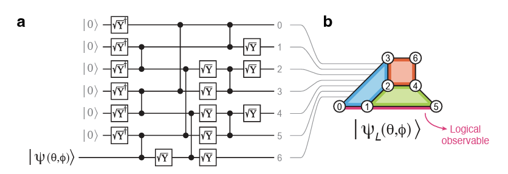
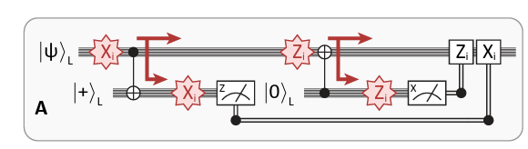

# **Technical challenge: Noise modeling + parallelism in QEC circuits**

## Summary

- Learn the basics of QEC and hardware-aware circuit design
- Develop an analysis starting from the [magic state injection circuit from QuEra’s MSD](https://arxiv.org/abs/2412.15165) work and tying it with [Steane error corretion](https://arxiv.org/pdf/2312.09745)
- Analyze performance under different error channels and encoding circuits
- Bonus: hand compile moves and write a bespoke simulation that captures the effect of noise in your compilation strategy

## Narrative

Neutral-atom quantum computing has a rich design space for performance due to its complex network of error channels. This network arises from flexibilities of the platform, such as the connection of distant qubits via coherent atom shuttling - possible within geometric and topological constraints - and the biases of decay and dephasing processes that atoms go through. 

The goal of this challenge is to expose you to the thought process of hardware-aware circuit design leveraging some of our tools for heuristically analyzing circuit performance under different architecture and noise models. You will build a rudimentary quantum memory experiment, based on post selection. 

### step 1

Revise the basic pipeline for building Bloqade kernels and simulating them with and without noise. Good references include our tutorials [“Circuits with Bloqade”](https://bloqade.quera.com/latest/digital/tutorials/circuits_with_bloqade/), [“Parallelism of Static Circuits”](https://bloqade.quera.com/latest/digital/tutorials/auto_parallelism/), and [“GHZ State Preparation with Noise”](https://bloqade.quera.com/latest/digital/examples/interop/noisy_ghz/). Make sure to also visit ["Tsim's page"](https://queracomputing.github.io/tsim/dev/)! 

### Step 2

Now that you have the basics, we are ready to go loose. Let's go straight to rudimentary techniques in quantum error correction. 

On QuEra’s work on [magic state distillation with logical qubits](https://arxiv.org/abs/2412.15165), the following circuit was proposed as a strategy to inject an arbitrary state on a distance 3 color code:

An interesting strategy to demonstrate the basic functionality of quantum error correction (QEC) is Steane’s approach. The process is summarized in the following figure (adapted from [this](https://arxiv.org/pdf/2312.09745) reference, which also contains an easy introduction to the topic on Sec. II):

For a [[7,1,3]] color code, such as in QuEra’s MSD paper, this should be easy to simulate. Notice that with Clifford-based choices of the encoded state, this can be efficiently simulated with Stim! (and with limited amounts of magic, with QuEra's Tsim!) So here are your tasks:

- Review the reference for the figure above and grasp the details of Steane QEC
- Implement the MSD state encoding circuit.
- Now bring Steane QEC in. Entangle the logical flag qubits and create a pipeline for multiple rounds of syndrome extraction and post-selection. Showcase you can read the stabilizers of the color code and reconstruct the logical information.
- Following on, testing the stability of the result agains the injection of different noise sources. 
    - insert manually noise channels on the circuit at arbitrary points of interest and verify the effect on your results
    - create a pipeline to export your Squin code to Cirq, and use QuEra's utils to automatically implement heuristic noise models based on our upcoming hardware. Evaluate the effects of different noise channels (moves, 2-qubit gates, etc) and determine which should be the most important and when.
    - use post-selection on syndromes of the flags to improve the performance of the logical qubit as a memory. Plot the logical error as function of a global scale of your physical error. Showcase the arise of different power laws and breakdown of performance improvement depending on the noise channels.

Scaling up the difficulty!    
- With the above, you should quickly learn that the circuit from the MSD state is prone to logical errors which might impact your analysis in the context of this challenge. Circumvent that by implement circuits for which non-magic states injected could perform better than magic-states (e.g. from Fig 6 [here](https://arxiv.org/pdf/2312.09745)), implementing different color code state injection circuits, or using flagging techniques (such as found [here](https://arxiv.org/pdf/2312.03982)) to improve state encoding. Try to optimize your methodology of choice for best parallelism. Evaluate performance under different noise models and levels. 

Scaling up even more!
- Bonus 1: increase code distance to 5 and evaluate the results again; compare performance. Notice new developments of circuits for distance 5 color code, for example [this](https://arxiv.org/pdf/2601.13313).
- Bonus 2: develop a pipeline for recurrent syndrome extraction with decoding and feedforward of corrections.
- Bonus 3: create your own optimal layout and atom moving protocol, and your corresponding noise model (see an example of the process [here](https://arxiv.org/abs/2507.10699), the the context of a different algorithm). Compare a bespoke noisy simulation against that of Bloqade’s native heuristic noisy simulation pipeline.
- Bonus 4: use Tsim as a simulation backend and show that you can keep alive a T-state memory. Push system sizes to distance 5 and showcase that you can do large noisy simulations including small amounts of magic using Tsim!

